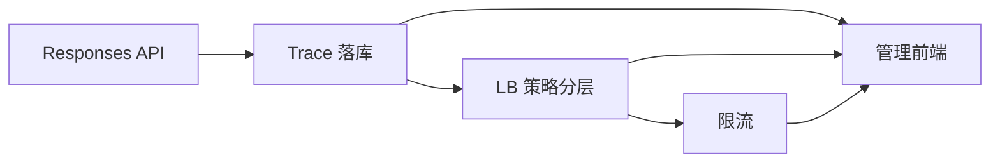

# Roadmap — 对照 axonhub 的补齐计划

> 基线：rust-one-api 已实现 OpenAI CC / Anthropic / Gemini 三协议互通转发、权重选渠道 + 换道重试、精确计费、API Key 日级配额、17 厂商配额探测、纯 JSON admin API（证据：`README.md`、`src/orchestrator.rs`、`src/provider_quota/routing.rs`）。
> 蓝本：axonhub（Go）的对应形态见各节「对照」。

## 差距总览

| 功能域 | 现状 | axonhub | 差距 |
|---|---|---|---|
| Responses API | ✅ 已完成（2026-09-30） | `/v1/responses` + 与 messages/chat_completions 双向互转 | — |
| Trace 落库 | ✅ 已完成（2026-09-30） | `requests` 概要 + `request_executions` 逐次执行（含 headers/body） | — |
| LB 策略 | 单一：权重排序 + 5xx/换道（`provider_quota/routing.rs`） | round_robin / weighted_shuffle / error-aware（时延+成功率）/ sticky + priority 失败转移 + 实例级默认策略 | 策略框架 + 4 种策略 + 配置 |
| 限流 | 无（Key 仅有日级配额，非速率） | 渠道 RPM burst（进程内）+ Key 日级配额（同我们） | 渠道速率限流全新 |
| 管理前端 | 无，纯 JSON admin API | React 19 + TanStack + Tailwind，`features/` 14 个模块 | 全新独立工程 |

## 阶段计划

> Embeddings 已按用户要求移出范围（2026-09-29）。

### Phase 1 — Responses API（协议面主力）✅ 已完成（2026-09-30）

对照：axonhub `openai_api_key` 渠道族支持 `/v1/responses`，且与 chat completions / Anthropic messages 双向互转，变换全部经 unified 格式。

- `crates/llm` 新增 `openai_responses` transformer，沿用 `InboundTransformer`/`OutboundTransformer` trait（与现有三个同构，协议层零业务依赖保持不变）。
  - 入站 `POST /v1/responses`：`instructions`/`input`（string 与 items 数组）/`tools`/`tool_choice`/`reasoning`/`max_output_tokens` → unified `Request`；Responses SSE 事件流（`response.created`/`response.output_item.*`/`response.output_text.delta` 等约 20 种语义事件）→ unified `StreamChunk`。
  - 出站 `channel_type = openai/responses`：unified → Responses 请求/事件序列。这样 Responses 客户端可打 `claude/messages`、`gemini/models` 上游，反向亦可，无需 N×N 转换。
- `src/server` 注册路由；`channel_type` 文档与枚举更新。
- 范围裁剪（首版不做）：`store`/`background`/`previous_response_id` 等有状态字段、`input_image` 之外的 `input_*` item；`reasoning` 仅透传摘要事件。裁掉的理由：axonhub 对这些也只做直通或忽略，且我们的统一模型无会话态。
- 验收：
  - `curl /v1/responses`（流式/非流式）分别打 `openai/responses`、`openai/chat_completions`、`claude/messages` 三种上游互通成功；mock 上游断言出站体是合法 Responses 格式。
  - `cargo test --workspace` 全绿，新增 transformer 单测（含 SSE 事件序列断言）≥ 现有 Anthropic 用例密度。
  - README API 表更新。

**交付记录（2026-09-30）**：
- 落地：`crates/llm/src/transformers/responses.rs`（入站+出站双向 transformer，`openai/responses` format）、`/v1/responses` 路由、probe 通用探活 alias、`scripts/mock_upstream.py` 增加 `/responses` mock；`outbound_format_for_channel_type` 恒等透传，无需编排层改动。
- 流式设计：所有关闭事件（`*.done`、`response.completed`）推迟到 `stream_end` 一次性发出，使终态事件携带完整 output + usage（CC 上游 usage 在 finish 之后才到）。
- 冒烟矩阵（7 场景实测通过）：Responses→CC（流/非流）、Responses→Responses、CC→Responses（流/非流）、Anthropic→Responses；`background:true` 按设计 400；计费 6 条 usage_log 全部 success。
- 计划外修复（同批交付）：CC 出站工具流增量块（无 id/type，仅 index+args 片段）解析失败导致流中止——`ToolCall`/`FunctionCall` 字段全部 serde-default 容错，新增 `ToolCall.index` 区分并行调用；连带修复 anthropic 入站多工具调用被吞进同一块 + `close_block` 二次递增导致块 index 跳号两个存量 bug。回归测试 3 个（CC 增量解析、anthropic 多块、responses 并行归位），三协议工具流端到端冒烟通过。

### Phase 2 — 请求 Trace 落库 ✅ 已完成（2026-09-30）

对照：axonhub 双表——`requests`（每逻辑请求一条概要：状态、模型、stream、首token/总延迟、成本）+ `request_executions`（每次渠道尝试一条，含请求/响应 headers 与 body、重试序号）；UI Traces 页依赖这两表。

- 迁移（`migrations/sqlite` + `migrations/postgres` 各一份，沿用 sqlx Any 双后端约定）：
  - `requests`：`id`、`api_key_id?`、`channel_id?`（最终成功道）、`model`、`stream`、`status`、`error`、`ttft_ms?`、`latency_ms`、`usage`（JSON）、`cost`、`created_at`。
  - `request_executions`：`id`、`request_id`（FK）、`attempt`、`channel_id`、`status`、`error`、`latency_ms`、`request_headers`/`request_body`/`response_headers`/`response_body`（TEXT，可空）。
- 写入：orchestrator 内建 `RequestTracer`，发完成 channel 后异步 `tokio::task` 落库——与流式计费 task 同模式，客户端断连不丢 trace。换道重试每次都追加 execution 行。
- 开关与体量控制（关键决策）：配置 `trace.level = off | meta | full`，默认 `meta`（只写概要+执行元数据，不写 body）；`full` 时 headers/body 截断至 16 KiB，敏感头（`authorization`/`x-api-key`）落库前脱敏。理由：全量 body 会让 SQLite 单文件迅速膨胀，axonhub 也是靠独立 data-storage 保留策略控制体感。
- Admin 查询 API：`GET /admin/traces`（时间/状态/模型/渠道/key 过滤 + 分页）、`GET /admin/traces/{id}`（含 executions 明细）。只读，与 `/admin/usage` 风格一致。
- 验收：
  - 一次含重试的请求（mock 上游第一次 5xx）落 1 条 request + 2 条 executions；流式请求记 `ttft_ms`；`trace.level=full` 时 body 可见且 Authorization 已脱敏。
  - respond 路径延迟对比（trace on/off）无可感知回归；双后端迁移均通过。

**交付记录（2026-09-30）**：
- 落地：迁移 `0004_traces.sql`（sqlite/postgres 双份，`requests` + `request_executions` 含全部约定索引）；`src/trace.rs`（`TraceLevel`/`RequestTracer`/`PendingAttempt`，脱敏与 16 KiB 截断，off 级全 no-op）；`TraceRepo`（insert/list_filtered/get/list_executions）；orchestrator 全路径埋点（5xx/401-403/4xx/网络错误/json/流式均记 execution）；`GET /admin/traces` + `GET /admin/traces/{id}`。
- 设计要点：`requests.id` 与 `usage_logs.request_id` 同源（tracer 生成，计费共用），两表可直接 join；trace 写入在响应完成后 `tokio::spawn` 落库（流式在既有独立 task 内顺带提交），respond 路径零等待；流式 trace 的 tracer 所有权经 `mem::take` 移入流 task，TTFT 以首个上游字节近似。
- 验收实测：failover 请求落 1 request + 2 executions（attempt1 `failed` 带 500 body、attempt2 `success`）；流式 `ttft_ms` 落值；full 级 `request_headers.Authorization = "***"` 且 body 完整可见；off 级请求后 `requests` 表零新增。sqlite + postgres（docker pg16）双后端迁移与读写均通过。
- 延迟粗测（本地 mock，各 30 请求）：trace=off p50=2.3ms / trace=full p50=2.3ms，无回归（写入不阻塞响应）。
- 测试：302 项全绿（新增 trace 单测 6、TraceRepo 集成 1、config 解析 1）；README（架构/API/测试计数）与 `config.example.yaml`（`trace.level`）已更新。

### Phase 3 — LB 策略分层 ◀ 下一步

对照：axonhub `ChannelBalancer` 接口 = `ChannelPool`（channels+keys 无状态纯函数）+ `LbSelector`（有状态状态机，融合熔断态）；策略枚举 `round_robin | weighted_shuffle | error_aware(success/latency EMA) | sticky`，渠道带 `priority` 排序失败转移，另有实例级 `default_override_settings`（`internal/server/biz/channel_balancer*.go`、`channel.go:277-285`）。

- 重构 `src/provider_quota/routing.rs`：现「权重排序」固化为 `weighted_shuffle` 策略，按 axonhub 双层拆：
  - `ChannelPool`：输入（渠道, 其 keys, 策略, 上下文）→ 排序后候选列表，纯函数可单测。
  - `LbSelector`：持有 `KeyState`（已有）+ 新策略状态，`insert_candidates`/`next`/`commit`/`rollback` 接口；把现有 exhausted 排除 + 换道重试收敛进 `next`。
- 新增策略：
  1. `priority`：渠道表加 `priority INT NOT NULL DEFAULT 0`，高优先级整组先试空再降级（axonhub ordering policy 同语义）。
  2. `round_robin`：channel+key 双枚举游标，状态压缩（仅存游标计数）。
  3. `error_aware`：channel 时延/成功率 EMA 打分；数据源用 Phase 2 的 requests 表惰性聚合（内存缓存 + 定期刷新），不引入实时统计组件。
  4. `sticky`：按请求会话键（`user` 字段或调用方显式 header）hash 固定渠道，TTL 惰性清理。**风险：selector 状态无限增长——axonhub 同坑，必须带 TTL 清扫。**
- 配置：渠道级 `lb_strategy?`（缺省回落）+ 实例级 `config.yaml` `lb.default`；落一张小配置表或沿用 YAML 均可，倾向 YAML（现状无运行时配置表，避免为单设置建表）。
- 验收：每个策略一组单测（候选顺序确定性，mock 固定随机源）；集成：3 渠道 priority 降级顺序、error_aware 在注入高延迟后切换偏好均可观测；全量回归 53 项基线外加新用例。

### Phase 4 — 限流

对照：axonhub = 渠道 API 容量（RPM + burst，进程内）+ API Key 日级配额（`channel_ratelimit.go`、`api_key.go:168`）；我们日级配额已有，缺的是速率维。

- 算法：token bucket（`governor` crate 或自研，进程内即可——单实例定位与 axonhub 一致，不引 Redis）。
- 维度：
  - 渠道级 `rate_limit: {rpm, burst}`（渠道表 JSON 列或独立列）。命中语义（对齐 axonhub）：**该渠道本次被跳过换道**，立即 `rollback` 试下一候选，积满候选才 503。
  - Key 级 `rate_limit.rpm`（扩 `api_key.quota` JSON）。命中语义：直接 `429` + `Retry-After`，不进编排。
- 挂载点：Key 级在 auth 后早退；渠道级放进 Phase 3 的 `LbSelector.next`——这也是限流排在 LB 分层之后的原因。
- 验收：mock 上游压 2×RPM 验证渠道轮换与 429 语义；bucket 状态不进库（进程级，重启清零为可接受行为，写进 README）。

### Phase 5 — 管理前端

对照：axonhub `frontend/src/features/`：dashboard / channels / api-keys / users / requests(Traces) / usage-logs / models / data-storages / system / oauth-setting 等 14 模块（React 19 + TanStack + Tailwind）。

- 选型（需要拍板）：建议 **Vite + React 19 + TanStack Router/Query + Tailwind**，与 axonhub 同栈可直接参照页面结构；`rust-embed` 打进单二进制，`/admin/` 静态托管 + 现 JSON API。**替代方案 Next.js 独立部署**——SEO 无需求、单二进制分发是 Rust 重写的主要卖点，故内嵌优先。
- 页面分两批：
  - 批 1（对应已有 API）：登录（admin token）、渠道 CRUD + 配额状态展示、API Keys CRUD、价格 CRUD。
  - 批 2（依赖前置阶段）：Dashboard（用量/成本/延迟图表，需新增 `/admin/dashboard` 聚合接口）、Traces 列表+详情（依赖 P2）、渠道 LB/限流配置表单（依赖 P3/P4）。
- Admin API 补齐：所有列表加分页（当前缺）、dashboard 聚合接口。
- 验收：前端 `pnpm build` 产物经 rust-embed 嵌入后，单二进制启动即可在 `/admin/` 完成「建渠道→建 key→发请求→看 trace」闭环，无外部依赖。

## 不在本期范围（观察到但未列入）

axonhub 还有而我们暂不排期的：data-storages 数据保留策略（届时 trace 表大了再加）、users/roles 多用户 RBAC（当前 admin token 单角色够用）、threads（Claude Code 线程）、models 管理页（可从渠道 supported_models 派生）、OAuth 设置页（我们 OAuth 仅用于上游配额探测）。任一需要可插到 P5 批次里。

## 全局约定

- 每阶段独立可交付合并；P2 是 P3/P5-批2 的前置，P3 是 P4 前置。
- 迁移一律 sqlite + postgres 双份；协议层改动不出 `crates/llm`。
- 每次交付：`cargo test --workspace` 全绿 + 对应 curl 冒烟脚本更新（`scripts/mock_upstream.py` 按新协议扩展）。
